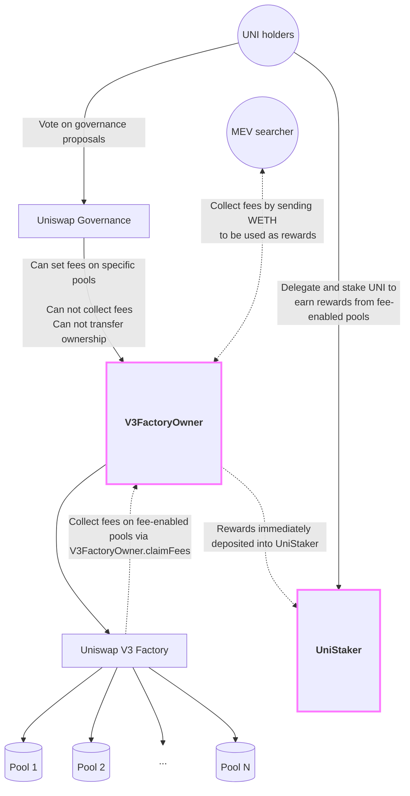
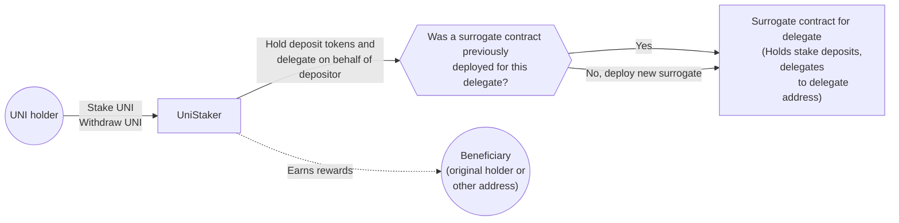

# Uniswap Foundation audit details

- Total Prize Pool: &#36;36,000 - &#36;92,000 in USDC 
  - HM awards: &#36;13,000 - &#36;69,000 in USDC (see note below)
  - Analysis awards: $1,500 in USDC
  - QA awards: $750 in USDC
  - Bot Race awards: $2,250 in USDC
  - Gas awards: $0 in USDC
  - Judge awards: $6,100 in USDC
  - Lookout awards: $2,400 USDC
  - Scout awards: $500 in USDC
  - Mitigation Review: $9,500 in USDC (*Opportunity goes to top 3 certified wardens based on placement in this audit.*)
- Join [C4 Discord](https://discord.gg/code4rena) to register
- Submit findings [using the C4 form](https://code4rena.com/contests/2024-02-unistaker-infrastructure/submit)
- [Read our guidelines for more details](https://docs.code4rena.com/roles/wardens)
- Starts February 23, 2024 20:00 UTC
- Ends March 4, 2024 20:00 UTC

❗️❗️ Please note: 
- If ANY valid Medium severity issues are found, the HM award will increase to &#36;45,000. The Total Prize Pool increases to &#36;68,000 in USDC.
- If ANY valid Medium + High severity issues are found, the HM award will increase to &#36;69,000. The Total Prize Pool increases to &#36;92,000 in USDC.
- All other awards will be capped at the amounts listed above.

## Automated Findings / Publicly Known Issues

The 4naly3er report can be found [here](https://github.com/code-423n4/2024-02-uniswap-foundation/blob/main/4naly3er-report.md).

Automated findings output for the audit can be found [here](https://github.com/code-423n4/2024-02-uniswap-foundation/blob/main/bot-report.md) within 24 hours of audit opening.

_Note for C4 wardens: Anything included in this `Automated Findings / Publicly Known Issues` section is considered a publicly known issue and is ineligible for awards._

1. A misbehaving reward notifier contract could grief stakers by frequently notifying this contract of tiny
  rewards, thereby continuously stretching out the time duration over which real rewards are
  distributed. It is required that reward notifiers supply reasonable rewards at reasonable
  intervals.
2. A misbehaving reward notifier contract could falsely notify this contract of rewards that were not actually
  distributed, creating a shortfall for those claiming their rewards after others. It is
  required that a notifier contract always transfers the `_amount` to this contract before
  calling this method.
3. Changes in the price of the `V3FactoryOwner.PAYOUT_TOKEN` relative to tokens in V3 Pools where fees are being collected can have adverse effects, as summarized:
   * If `PAYOUT_TOKEN` price rises relative to fee tokens, fees are rarely or never collected
   * If `PAYOUT_TOKEN` price drops relative to fee tokens, fees are may be collected so frequently that value is leaked when a large trade puts a pool substantially over the value of `payoutAmount`
4. Changes to the `payoutAmount`, or , can have adverse effects, as summarized:
   *  An adjustment of `payoutAmount` to a lower value means that the protocol potentially leaks value at the time of the transaction to change the reward amount
   * An adjustment of `payoutAmount` to a higher value could break or adversely impact MEV bots who will provide rewards by arbitraging fee collection
5. Permit based convenience methods front running griefing attack: someone could front-run the call to permit which would cause these functions to revert.

# Overview

# UniStaker

**Uniswap V3 protocol fee collection and distribution via UNI staking.**


## What it does

This repository contains contracts which allow Uniswap Governance to enable and manage protocol fees on Uniswap V3. If Uniswap Governance chooses to upgrade to these contracts, it will retain the right to set protocol fees on Uniswap V3 Pools but it will not control the fee assets themselves. Instead, the revenue generated by the fees is trustlessly distributed to those UNI holders who choose to delegate and stake their tokens.

Rewards do not accumulate to stakers in the fee tokens. Rather, rewards accumulate in a token defined during the deployment of the contracts in this repo. The fees accrued by each pool are continually auctioned to any entity who is willing to pay a fixed amount of that token to the staking contract in exchange for the fee tokens accrued by a given pool.

UNI holders who stake their tokens are required to delegate their governance voting weight, either to themselves, or to another entity who can vote on their behalf.

Stakers earn a share of rewards proportional to their share of the total UNI staked. Stakers only earn rewards while their tokens are deposited. When a staker deposits, they earn a share of the ongoing reward distribution. When a staker withdraws, they stop earning rewards.

Stakers may designate an address which is the beneficiary of their staking rewards. This means an address can earn rewards on behalf of the original depositing address of the UNI tokens. The address which performs the deposit retains the right to withdraw and update the staking position.

Each deposit is tracked on a per-position basis. Stakers may add to or withdraw UNI from a given deposit balance, or may alter the governance delegation and reward beneficiary associated with that deposit. A given address can have any number of deposit positions which are each tracked and managed independently.

To take effect, Uniswap Governance must successfully pass a vote to upgrade ownership of the V3 factory to this system. Once transferred to these contracts, that ownership cannot be revoked. While Governance may continue to adjust fee levels and rewards parameters, it irrevocably relinquishes the ability to claim the fees earned for itself. These would forever be distributed to UNI stakers.

The staking system allows for other contracts to be added as revenue sources for staking reward distribution in the future.

## How it works

The system consists of two core contracts which are designed to be deployed into, and interact with, the existing ecosystem of Uniswap contracts operating onchain. The two new contracts are `V3FactoryOwner.sol` and the `UniStaker.sol`. The former manages ownership of the existing Uniswap V3 Factory contract, while the latter manages staking mechanics and the distribution of rewards to stakers.



### `V3FactoryOwner`

The [`V3FactoryOwner`](https://github.com/code-423n4/2024-02-uniswap-foundation/blob/main/src/V3FactoryOwner.sol) contract is designed to act as the owner of the Uniswap V3 Factory. Governance can opt to transfer ownership of the factory to an instance of this contract. While the owner of the factory becomes the `V3FactoryOwner`, the admin of the `V3FactoryOwner` will be governance. In this way, governance retains the right to configure pool protocol fees via permissioned passthrough methods.

The `V3FactoryOwner` has a public method which enables _anyone_ to claim the protocol fees which have accrued for a given pool. In order to claim the fees, the caller must pay a fixed amount of a token defined when the `V3FactoryOwner` is deployed (the `PAYOUT_TOKEN`). This sets up a continuous "race" wherein external parties will compete to claim the fees accrued by each pool once it becomes profitable to do so.

Concretely, if the `PAYOUT_TOKEN` was WETH, a third party would claim a pool's fees by paying for them in WETH, which would be sent to the staking contract for distribution to stakers.

### `UniStaker`

The mechanics of the [`UniStaker`](https://github.com/code-423n4/2024-02-uniswap-foundation/blob/main/src/UniStaker.sol) contract are heavily inspired by the Synthetix [`StakingRewards.sol`](https://github.com/Synthetixio/synthetix/blob/develop/contracts/StakingRewards.sol) implementation. The contract manages the distribution of rewards to stakers by dripping those rewards out over a fixed period of time. This period restarts if more rewards are distributed (e.g. by the public fee claiming mechanism on `V3FactoryOwner` detailed above). This Synthetix style staking mechanism has been widely discussed in the DeFi ecosystem and should be reviewed by any party seeking to understand the mechanics of UniStaker.



The UniStaker contract diverges from `StakingRewards.sol` in several ways:

First, UniStaker enfranchises depositors by allowing them to retain their UNI governance rights. It does this by depositing staked tokens to an instance of [`DelegationSurrogate`](https://github.com/code-423n4/2024-02-uniswap-foundation/blob/main/src/DelegationSurrogate.sol), a dummy contract whose sole purpose is to delegate voting weight to a designated entity. UniStaker requires stakers to delegate to themselves or another address. They cannot delegate to the zero address.

Second, UniStaker allows depositors to designate the beneficiary of their staking rewards. Effectively, any given deposit can earn rewards on behalf of any designated address.

Third, UniStaker tracks stake on a per-deposit basis. Stakers may add to or withdraw UNI from a given deposit balance, or may alter the governance delegation and reward beneficiary associated with that deposit. A given address can have any number of deposit positions which are each tracked and managed independently.

Fourth, UniStaker has a bevy of small improvements to the Synthetix staking mechanism. These include optimizations for greater precision, lower gas usage, and refactoring for the sake of clearer code.

Finally, UniStaker is designed to accept rewards from any number of addresses designated by the admin. While Uniswap V3 protocol fees will be the only source of rewards initially, it is possible to add more in the future. Uniswap Governance will serve as the admin with the ability to add reward sources in the future.

## Links

- **Previous audits:** Audit by Trail of Bits (not yet public, will be release soon)
- **Documentation:** http://docs.unistaker.xyz
- **Website:** N/A
- **Twitter:** N/A
- **Discord:** N/A


# Scope

| Contract | SLOC | Purpose | Libraries used |  
| ----------- | ----------- | ----------- | ----------- |
| _Contracts (3)_ |  |  |  |
| [src/UniStaker.sol](https://github.com/code-423n4/2024-02-uniswap-foundation/blob/main/src/UniStaker.sol) | 423 | This contract manages the distribution of rewards to stakers. | [`@openzeppelin/*`](https://openzeppelin.com/contracts/) |
| [src/V3FactoryOwner.sol](https://github.com/code-423n4/2024-02-uniswap-foundation/blob/main/src/V3FactoryOwner.sol) | 87 | A contract that can serve as the owner of the Uniswap v3 factory and manages configuration and collection of protocol pool fees. | [`@openzeppelin/*`](https://openzeppelin.com/contracts/) |
| [src/DelegationSurrogate.sol](https://github.com/code-423n4/2024-02-uniswap-foundation/blob/main/src/DelegationSurrogate.sol) | 8 | A dead-simple contract whose only purpose is to hold governance tokens on behalf of stakers while delegating voting power to a specific delegatee. | None |
| _Interfaces (4)_ |  |  |  |
| [src/interfaces/IERC20Delegates.sol](https://github.com/code-423n4/2024-02-uniswap-foundation/blob/main/src/interfaces/IERC20Delegates.sol) | 22 | A subset of the ERC20Votes-style governance token to which UNI conforms. |  |
| [src/interfaces/INotifiableRewardReceiver.sol](https://github.com/code-423n4/2024-02-uniswap-foundation/blob/main/src/interfaces/INotifiableRewardReceiver.sol) | 4 | The communication interface between the V3FactoryOwner contract and the UniStaker contract. |  |
| [src/interfaces/IUniswapV3FactoryOwnerActions.sol](https://github.com/code-423n4/2024-02-uniswap-foundation/blob/main/src/interfaces/IUniswapV3FactoryOwnerActions.sol) | 6 | Required subset of the interface for the Uniswap V3 Factory. |  |
| [src/interfaces/IUniswapV3PoolOwnerActions.sol](https://github.com/code-423n4/2024-02-uniswap-foundation/blob/main/src/interfaces/IUniswapV3PoolOwnerActions.sol) | 7 | Interface for pool methods that may only be called by the factory owner. |  |


## Out of scope

* [`scripts/*`](https://github.com/code-423n4/2024-02-uniswap-foundation/blob/main/script)


# Additional Context

* The following real tokens will be used for the tokens defined in these contracts
  * `UniStaker.REWARD_TOKEN` - [WETH](https://etherscan.io/token/0xc02aaa39b223fe8d0a0e5c4f27ead9083c756cc2)
  * `UniStaker.STAKE_TOKEN` - [UNI](https://etherscan.io/token/0x1f9840a85d5af5bf1d1762f925bdaddc4201f984)
  * `V3FactoryOwner.PAYOUT_TOKEN` - [WETH](https://etherscan.io/token/0xc02aaa39b223fe8d0a0e5c4f27ead9083c756cc2)
* The contracts will run on Ethereum Mainnet only
* Trusted roles in the system include:
  * `UniStaker.admin` - Can whitelist reward notifier contracts. Can transfer the admin role. To be held by Uniswap DAO Governance.
  * `V3FactoryOwner.admin` - Can call passthrough methods to the V3 Factory and V3 Pool contracts. Can transfer the admin role. Can set the payout amount. To be held by Uniswap DAO Governance.


## Attack ideas (Where to look for bugs)

* Overflows
* Rounding not favoring the protocol
* Rewards shortfalls
* Boundary conditions on reward notification
* Unexpected conditions due to unexpected interactions with/configuration of a Uniswap V3 Pool
* Governance based economic/incentive attacks
* Unexpected issues caused by (good faith) reward notifier contracts being added or removed in the future
* Issues caused by changes in network conditions due to network upgrade (the contracts are intended to be immutable)
* Attacks or bugs caused by account abstraction or smart contract wallet usage

## Main invariants

1. The contract’s totalStaked variable is equal to the sum of all deposits less the sum of all withdrawals.
2. The sum of the governance token balances of all the surrogate contracts is equal to the sum of all deposits less the sum of all withdrawals.
3. The sum of all users’ depositorTotalStaked amounts is equal to the value of totalStaked.
4. The sum of all users’ deposits balances is equal to the sum of all deposits less the sum of all withdrawals.
5. The sum of the amounts delegated to delagatees is equal to the contract’s totalStaked variable.
6. The sum of all amounts applied to beneficiaries is equal to the contract’s totalStaked variable.
7. The sum of all beneficiaries’ earningsPower amounts is equal to the sum of all deposits less the sum of all withdrawals.
8. The sum of the increases in beneficiaries’ reward token balances is equal to the rewards distributed by the system.
9. The sum of the increases in beneficiaries’ reward token balances plus the reward token balance of the UniStaker contract is equal to the sum of all rewards notified, plus the sum of all reward token donations, less the sum of rewards claimed, less the sum of all rewards not transferred in during reward notification
10. The UniStaker contract’s reward token balance is equal to the sum of all rewards notified, plus the sum of all reward token donations, less the sum of rewards claimed, less the sum of all rewards not transferred in during reward notification
11. The lastCheckpointTime variable is greater than or equal to the previous value.
12. The rewardPerTokenAccumulatedCheckpoint amount is greater than or equal to the previous amount.


## Scoping Details

```
- If you have a public code repo, please share it here: https://github.com/uniswapfoundation/unistaker (will be public at audit start date)
- What is the overall line coverage percentage provided by your tests?: 100
- Is this an upgrade of an existing system?: False
- Is there a need to understand a separate part of the codebase / get context in order to audit this part of the protocol?: True
- Please describe required context: Fees are collected from individual Uniswap V3 Pools via a function on one of the new contracts. That function calls the 'collectProtocol' function on pool contracts. The contracts will interact with the Uniswap V3 Pools and Uniswap V3 Factory. The contracts will administered by Uniswap DAO Governance.
- Is this either a fork of or an alternate implementation of another project?: True - The staking model is heavily borrowed, but modified
```

# Tests

These contracts were built and tested with care by the team at [ScopeLift](https://scopelift.co).

### Build and test

This project uses [Foundry](https://github.com/foundry-rs/foundry). Follow [these instructions](https://github.com/foundry-rs/foundry#installation) to install it.

Clone the repo.

Set up your .env file

```bash
cp .env.template .env
# edit the .env to fill in values
```

Install dependencies & run tests.

```bash
forge install
forge build
forge test
```

### Spec and lint

This project uses [scopelint](https://github.com/ScopeLift/scopelint) for linting and spec generation. Follow [these instructions](https://github.com/ScopeLift/scopelint?tab=readme-ov-file#installation) to install it.

To use scopelint's linting functionality, run:

```bash
scopelint check # check formatting
scopelint fmt # apply formatting changes
```

To use scopelint's spec generation functionality, run:

```bash
scopelint spec
```

This command will use the names of the contract's unit tests to generate a human readable spec. It will list each contract, its constituent functions, and the human readable description of functionality each unit test aims to assert.

## Miscellaneous

Employees of Uniswap Foundation and employees' family members are ineligible to participate in this audit.

The code in this repository is licensed under the [GNU Affero General Public License](LICENSE) unless otherwise indicated.

Copyright (C) 2024 The Uniswap Foundation
